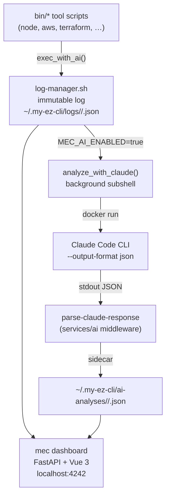

# My Ez CLI

[](https://github.com/DavidCardoso/my-ez-cli/actions/workflows/test.yml)
[](https://github.com/DavidCardoso/my-ez-cli/actions/workflows/docker-build-dashboard.yml)


CLI tools over Docker — managed by `mec`.

> Docker-based dev tools + AI analysis powered by Claude Code. See [docs/ROADMAP.md](./docs/ROADMAP.md) for current status.

## Table of Contents

- [Prerequisites](#prerequisites)
- [Getting Started](#getting-started)
- [`mec` CLI Reference](#mec-cli-reference)
  - [Setup & Installation](#setup--installation)
  - [Configuration](#configuration)
  - [Log Management](#log-management)
  - [AI Analysis](#ai-analysis----mec-ai)
  - [Dashboard](#dashboard----mec-dashboard)
  - [Health Check](#health-check----mec-doctor)
  - [Purge](#purge----mec-purge)
  - [Claude Code](#claude-code----mec-claude)
- [AI Features](#ai-features)
  - [TUI](#tui----mec-ai)
  - [Web Dashboard](#web-dashboard----mec-dashboard)
- [Documentation](#documentation)
- [Tools](#tools)
  - [AWS CLI](#aws-cli)
  - [Python](#python)
  - [NodeJS](#nodejs)
  - [NPM](#npm)
  - [NPX](#npx)
  - [Yarn](#yarn)
  - [Serverless Framework](#serverless-framework)
  - [Terraform](#terraform)
  - [Ookla Speedtest CLI](#ookla-speedtest-cli)
  - [Google Cloud CLI](#google-cloud-cli)
  - [Playwright](#playwright)
  - [Promptfoo](#promptfoo)
  - [Claude Code (tool)](#claude-code-tool)
- [Author](#author)
- [Contributors](#contributors)

## Prerequisites

- [Docker](https://www.docker.com/get-started)
- [Zshell + Oh My Zsh](https://ohmyz.sh/)

## Getting Started

`mec` is the main interface for My Ez CLI. Run the setup wizard to install tools:

```shell
mec setup
```

Or install specific tools directly:

```shell
mec install node terraform aws
```

<!-- TODO: remove the ./setup.sh bootstrap step once this project is distributed as an installable package (Homebrew, npm, etc.) — at that point `mec` will be available immediately after install -->
> **First time?** If `mec` is not yet available, run `./setup.sh` once to bootstrap it, then use `mec` for everything else.

After setup, `mec` manages tools, configuration, AI analysis, logs, and the dashboard. Run `mec help` to see all commands.

## `mec` CLI Reference

### Setup & Installation

```shell
mec setup              # Interactive TUI — install/uninstall tools
mec setup show         # Show installation status of all tools
mec install node aws   # Install specific tools
mec uninstall terraform
```

For detailed installation options, see [docs/SETUP.md](./docs/SETUP.md).

### Configuration

```shell
mec config list                        # Show all config
mec config get ai.dashboard.port       # Get a specific value
mec config set ai.enabled true         # Set a value
mec config set ai.dashboard.port 8080
mec config edit                        # Edit config file in $EDITOR
mec config reset                       # Reset to defaults
```

Config is stored at `~/.my-ez-cli/config.yaml`. See [docs/CONFIGURATION.md](./docs/CONFIGURATION.md) for all keys.

### Log Management

```shell
mec logs status                        # Show logging status
mec logs enable                        # Enable log persistence
mec logs disable
mec logs list                          # List recent sessions
mec logs list --tool node --last 20
mec logs failures                      # Show only failed sessions (exit code != 0)
mec logs stats                         # Per-tool statistics
```

### AI Analysis — `mec ai`

```shell
mec ai status            # Show AI status and configuration
mec ai enable            # Enable automated analysis after each tool run
mec ai disable
mec ai test              # Test Claude Code connectivity
mec ai last              # Show most recent AI analysis
mec ai show <session_id> # Show analysis for a specific session
mec ai logs              # List recent sessions with AI status
mec ai analyze <log>     # Analyze a log file manually
```

See [AI Features](#ai-features) for the full workflow.

### Dashboard — `mec dashboard`

```shell
mec dashboard start      # Start the web UI (Docker container on port 4242)
mec dashboard stop
mec dashboard restart
mec dashboard status
mec dashboard open       # Open the dashboard in the default browser
```

See [Web Dashboard](#web-dashboard----mec-dashboard) for page reference.

### Health Check — `mec doctor`

```shell
mec doctor               # Check Docker, Zsh, tools, AI, dashboard, and data directory health
```

Prints a structured report with ✓ pass / ⚠ warn / ✗ fail per check and a summary. Exits `1` if any check fails — scriptable.

### Purge — `mec purge`

```shell
mec purge data                           # Delete all logs + AI analyses (interactive)
mec purge data --dry-run                 # Preview what would be deleted
mec purge data --tool node               # Only node logs + analyses
mec purge data --older-than 30           # Only files older than 30 days
mec purge data --only-logs --tool aws    # Only aws logs (keep AI analyses)
mec purge data -y                        # Skip confirmation prompt
```

### Claude Code — `mec claude`

```shell
mec claude                                      # Launch interactive Claude Code session
mec claude firewall status                      # Show network firewall config
mec claude firewall enable                      # Enable container firewall
mec claude firewall add dns registry.npmjs.org  # Allow a domain (requires image rebuild: mec claude firewall rebuild)
```

### Other

```shell
mec version   # Show version (e.g., my-ez-cli version 1.0.0)
mec help      # Full command reference
```

---

## AI Features

My Ez CLI automatically analyses every tool execution with Claude Code when `MEC_AI_ENABLED=true`. Requires an API key or OAuth token — see [authentication methods](./docker/claude/README.md#authentication).

### TUI — `mec ai`

```shell
mec ai enable            # Enable automated analysis
mec ai status            # Check status
mec ai last              # Show most recent analysis
mec ai show <session_id>
mec ai logs              # List sessions with AI status
```

After each tool execution the terminal prints:

```
[mec-ai] Analysis running in background...
[mec-ai] Session:  mec-node-1774467258
[mec-ai] Results:  http://localhost:4242/sessions/mec-node-1774467258
[mec-ai]           (or: mec ai last)
```

When `mec ai last` or `mec ai show` reports a completed analysis it also prints a **resume hint**:

```
Resume:    claude --resume <claude_session_id>
```

### Web Dashboard — `mec dashboard`

A local web UI showing all sessions, live stats, and AI analysis results.

```shell
mec dashboard start    # start
mec dashboard open     # open in browser
mec dashboard stop
```

| URL | What |
|-----|------|
| `http://localhost:4242/` | Home — stat cards + activity charts |
| `http://localhost:4242/sessions` | Session list with search and filters |
| `http://localhost:4242/sessions/<id>` | Session detail — log output + AI analysis |
| `http://localhost:4242/tools` | Tool registry |
| `http://localhost:4242/api/` | REST API |

**Change the default port:**

```shell
mec config set ai.dashboard.port 8080
mec dashboard restart
```

<details>
<summary>Architecture overview</summary>



</details>

For detailed AI documentation, see [docs/AI_INTEGRATION.md](./docs/AI_INTEGRATION.md).

---

## Documentation

### For users

- **[docs/SETUP.md](./docs/SETUP.md)** — Installation guide, conflict detection, advanced options
- **[docs/CONFIGURATION.md](./docs/CONFIGURATION.md)** — All config keys, environment variables, Docker container management
- **[docs/AI_INTEGRATION.md](./docs/AI_INTEGRATION.md)** — AI workflow, Claude Code integration, authentication
- **[services/dashboard/README.md](./services/dashboard/README.md)** — Dashboard stack, pages, API reference, development guide
- **[config/aws/README.md](./config/aws/README.md)** — AWS CLI configuration examples

### For contributors

- **[CLAUDE.md](./CLAUDE.md)** — Architecture reference and contributor guide
- **[docs/ROADMAP.md](./docs/ROADMAP.md)** — Phase status and future plans
- **[docs/CODE_STANDARDS.md](./docs/CODE_STANDARDS.md)** — Python code standards (type hints, error handling, logging)
- **[docs/LOG_FORMAT.md](./docs/LOG_FORMAT.md)** — JSON log schema, sidecar files, rotation
- **[docs/DOCKER_HUB.md](./docs/DOCKER_HUB.md)** — Docker Hub images, CI/CD workflows, GitHub Secrets
- **[tests/README.md](./tests/README.md)** — Testing framework, writing and running tests
- **[CONTRIBUTING.md](./CONTRIBUTING.md)** — Contribution guidelines
- **[CHANGELOG.md](./CHANGELOG.md)** — Release history

### Tool image READMEs

- **[docker/claude/README.md](./docker/claude/README.md)** — Claude Code image, authentication methods
- **[docker/ai-service/README.md](./docker/ai-service/README.md)** — AI I/O middleware image
- **[docker/serverless/README.md](./docker/serverless/README.md)** — Serverless Framework image
- **[docker/speedtest/README.md](./docker/speedtest/README.md)** — Ookla Speedtest image
- **[docker/yarn-berry/README.md](./docker/yarn-berry/README.md)** — Yarn Berry image
- **[docker/yarn-plus/README.md](./docker/yarn-plus/README.md)** — Yarn Plus image
- **[docker/aws-sso-cred/README.md](./docker/aws-sso-cred/README.md)** — AWS SSO credentials image

---

## Tools

<details>
<summary><strong>AWS CLI</strong></summary>

> See [more](config/aws).

```shell
aws help
aws s3 ls --profile my-aws-profile
aws s3 cp s3://my-bucket/my-file /path/to/local/file --profile my-aws-profile
```

**AWS Get Session Token** — authenticate using MFA:

```shell
aws-get-session-token <MFA_DIGITS>
```

**AWS SSO** — authenticate using SSO:

```shell
aws-sso
# 1) configure  2) login  3) logout
```

**AWS SSO Get Credentials** — retrieve current SSO credentials ([docker image](docker/aws-sso-cred/)):

```shell
aws-sso-cred $AWS_PROFILE
```

</details>

<details>
<summary><strong>Python</strong> — default: 3.12.4</summary>

```shell
python --version
python main.py
```

Uses the same `PYENV_VERSION` convention as [PyEnv](https://github.com/pyenv/pyenv):

```shell
PYENV_VERSION=3.9.19 python main.py
```

</details>

<details>
<summary><strong>Node.js</strong> — default: Node 24 LTS</summary>

```shell
node -v
node somefile.js
```

Multi-version support:

```shell
node20 -v  # maintenance LTS
node22 -v  # default (LTS)
node24 -v
```

**Custom ports** — use `MEC_BIND_PORTS`:

```shell
MEC_BIND_PORTS="8080:80" node
MEC_BIND_PORTS="8080:80" npm
MEC_BIND_PORTS="8080:80" yarn
```

**Private NPM registry** — pass `NPM_TOKEN`:

```shell
NPM_TOKEN=your-token-here npm install
```

Or configure `~/.npmrc`:

```
registry=https://private.npm.registry.com/
//private.npm.registry.com/:_authToken=${NPM_TOKEN}
```

</details>

<details>
<summary><strong>NPM</strong> — default: Node 24</summary>

```shell
npm -v
npm init
npm install some-pkg --save-dev
npm install -g another-pkg
```

Version suffixes: `npm20`, `npm22`

</details>

<details>
<summary><strong>NPX</strong> — default: Node 24</summary>

```shell
npx cowsay "Hello!"
```

Version suffixes: `npx20`, `npx22`

</details>

<details>
<summary><strong>Yarn</strong> — default: Node 24</summary>

```shell
yarn -v
yarn init
yarn add some-pkg --dev
yarn global add another-pkg
```

Version suffixes: `yarn20`, `yarn22`

**Yarn Berry (v2+)**:

```shell
yarn-berry --version  # 3.6+
```

**Yarn Plus** — Yarn with `git`, `curl`, `jq` pre-installed (useful for [Projen](https://projen.io/)):

```shell
yarn-plus install
```

</details>

<details>
<summary><strong>Serverless Framework</strong> — AWS-ready</summary>

> [Docker image details](docker/serverless) · [Docs](https://www.serverless.com/framework/docs/getting-started)

```shell
serverless -v
serverless deploy
serverless invoke -f hello
serverless logs -f hello --tail
```

</details>

<details>
<summary><strong>Terraform</strong></summary>

> **Important**: ensure correct credentials/roles before running any command.
> [AWS modules registry](https://registry.terraform.io/browse/modules?provider=aws)

```shell
terraform init
terraform plan
terraform apply
terraform destroy
```

| Variable | Default | Purpose |
|----------|---------|---------|
| `CONTEXT` | parent dir | Override mounted directory (for module paths outside `$PWD`) |
| `DOTENV_FILE` | `${PWD}/.env` | Inject env vars into container |
| `TF_RC_FILE` | `~/.terraformrc` | Terraform Cloud credentials |
| `AWS_CREDENTIALS_FOLDER` | `~/.aws` | AWS credentials folder |
| `AWS_PROFILE` | — | AWS profile to use |
| `GCLOUD_CREDENTIALS_FOLDER` | `~/.config/gcloud` | GCP credentials folder |
| `GOOGLE_APPLICATION_CREDENTIALS` | `/root/.config/gcloud/application_default_credentials.json` | GCP service account key |

</details>

<details>
<summary><strong>Ookla Speedtest CLI</strong></summary>

> [Docker image details](docker/speedtest/README.md)

```shell
speedtest
```

</details>

<details>
<summary><strong>Google Cloud CLI</strong></summary>

> [gcloud CLI overview](https://cloud.google.com/sdk/gcloud)

```shell
gcloud-login                           # interactive OAuth
gcloud config set project <PROJECT_ID>
gcloud storage ls
```

</details>

<details>
<summary><strong>Playwright</strong></summary>

> [Official documentation](https://playwright.dev/docs/docker)

```shell
playwright                         # opens bash inside the container
npx playwright install chromium
npm run test
```

</details>

<details>
<summary><strong>Promptfoo</strong> — LLM evaluation tool</summary>

> [Official docs](https://www.promptfoo.dev/docs/getting-started)

```shell
export PROMPTFOO_CONFIG_DIR="/app/data"
export ANTHROPIC_API_KEY="your-key-here"

promptfoo eval
promptfoo eval --share
```

**Promptfoo Server** — self-hosted UI ([docs](https://www.promptfoo.dev/docs/usage/self-hosting/)):

```shell
export PROMPTFOO_API_PORT=33333
promptfoo-server       # starts in detached mode
open http://localhost:33333
```

</details>

<details>
<summary><strong>Claude Code</strong> — AI coding assistant</summary>

> Requires authentication — see [docker/claude/README.md](./docker/claude/README.md#authentication)

```shell
claude                          # interactive mode
claude -p "help me debug this"  # single-shot prompt
claude --version
```

Authentication methods:

- **API key** (`ANTHROPIC_API_KEY`) — uses Anthropic Console credits
- **OAuth long-lived token** (`CLAUDE_CODE_OAUTH_TOKEN`) — uses Claude.ai subscription
- **OAuth web login** — run `claude` interactively; session persists via `~/.claude/`

</details>

---

## Author

[David Cardoso](https://github.com/DavidCardoso)

## Contributors

Feel free to become a contributor! ;D
